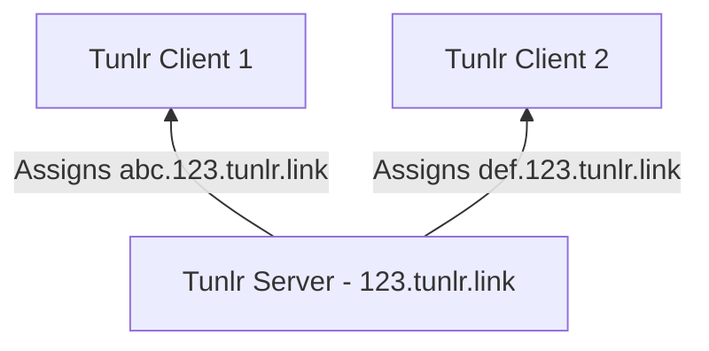
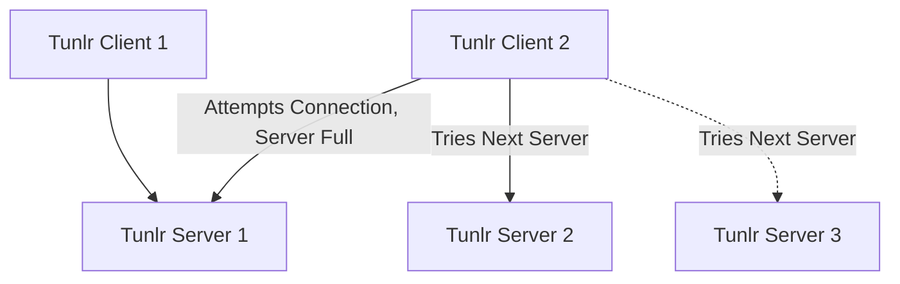

---
categories:
- feature
description: Tunlr provides a scalable way to expose all of your dynamic environments.
title: Scalable Access
type: docs
---

## Scalable Single Node

Each Tunlr server is designed to operate statelessly and entirely in-memory.  Each server is delegated a DNS subdomain and generates random hostnames from the subdomain for each client:

## Scale-Out Server List

Tunlr's architecture is designed to support an unlimited number of clients in a scale-out architecture:

