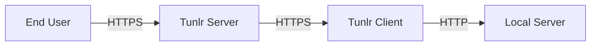

---
categories:
- feature
description: Tunlr provides a secure way to expose environments globally.
title: Secure Access
type: docs
---

## Client

Tunlr provides secure access to your local environments:

## Server

Tunlr server can be configured for secure access from Tunlr clients and proxy users:

- Clients can be required to authenticate
- Clients can optionally be allowed to request specific hostnames
- Clients and proxy users can be required to use TLS certificates
- All access can be logged and monitored
