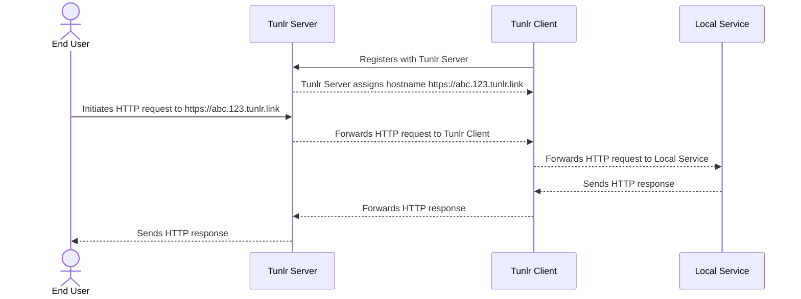

---
categories:
- explanation
description: Level set understanding of Tunlr and how it works.
title: Architecture
---

Tunlr is a CLI tool that allows users to access environments without having direct access to them.  The same CLI tool can be ran in two different modes:

- [Server](#server)
- [Client](#client)

This diagram shows how Tunlr works at a high level:

## Server

Tunlr server is a stateless, highly scalable HTTP server.  Clients connect to the server and wait for requests from end users.  End users send requests to the server, the server routes their request to a client, and the server returns the response from a client.

Tunlr server most have a DNS domain delegated to it and be reachable directly from Tunlr Clients.  A valid SSL/TLS certificate is highly recommended.

{}
Tunlr can be easily integrated with ACME clients like [acme.sh](https://github.com/acmesh-official/acme.sh).
{}

## Client

Tunlr client is a local proxy provider.  The client connects to a server, waits for requests, and forwards them to local targets that it can reach.  The Tunlr Client does not need be accessible externally, but it must be able to connect to the Tunlr Server.

{}
Tunlr clients can work from anywhere, but you need to keep in mind the round trip latency for end users:

- UserA -> Tunlr Server = 100ms
- Tunlr Server -> Tunlr Client = 100ms

In this example, responses back to users could take up to 400ms to complete.  Tunlr servers should be deployed as close to clients and/or users as possible.  Tunlr's proxy protocol is very bandwidth efficient, but everything must obey the speed of light.
{}
